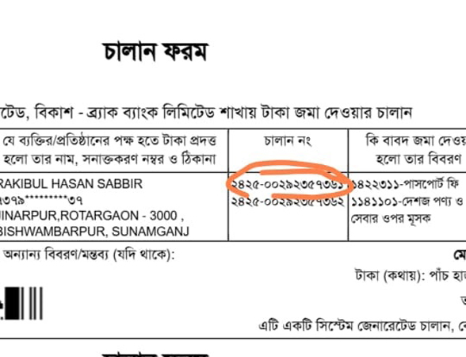

# passport-file-setup-1000

## passport apply

Type of Citizenship:-  BY BIRTH

Profession:-  PRIVATE SERVICE

31.email:- rejaulkarim2712@gmail.com

43..Road/Block/Sector:- (x) লাগবে না

50.. 43..Road/Block/Sector:- (x) লাগবে না
55.. Father profession :- FARMER
55.. mmother profession :- HOUSE WIFE

## Emaegency Contact

travelse code email:- JAMALM18@GMAIL.COM

## ডোকোমেন্ট সেট করে দিতে হবে আবেদন কারিকে

(1) চালান ফরম

(2) Application submitted  BDT:- 5750 tk

(3) গনপ্রজাতন্তী বাংলােদশ সরকার  ইমিগ্রশেন পাসেপাট 1-2-3 পাতা

 (4) আবেদন কারি নিজ ভোটার Nid id মূল কপি এবং ফটোকপি

 (5) পিতার Nid id মূল কপি এবং ফটোকপি
 
 (6) মাতা Nid id মূল কপি এবং ফটোকপি

 # এস্টা আবেদনের সময় কাজে লাগে।

 (7) মোবাইল নং:- -------

<!--[profile](./c.jpeg)-->

## যে চারটি লেখা লিখতে হবে।
 
 (86)  Bank Name : ACHLAN
 

 (87)  Payment Reference No. চালান নং হবে
 

 (88)  Payment Date- যত তারিখে করা হয় হয়েছে
 
 
 (89) Paid Amount: 5750 tK
 

 # আবেদন কারির ফিলাপ

 (১) তারিক লিখতে হবে যে তারিখে আবেদন করা হবে উক্ত তারিখ

 (2) আবেদন কারির স্বাক্ষর 
